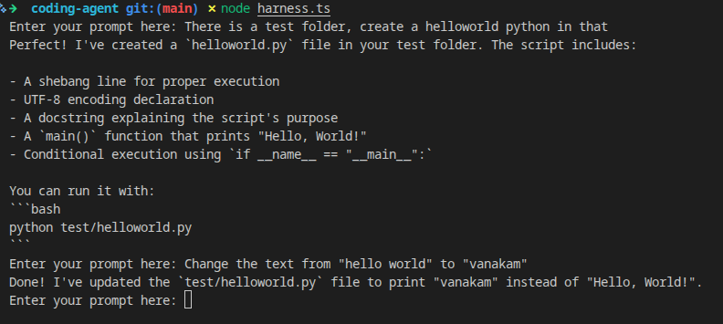

# Changelog
## 2026-06-30
- Add basic REPL and command line based input using readline-sync library

## 2026-06-29
- Added basic bash tool with command validation
- Added a basic read tool to read 
- Added a basic tool to write file

## 2026-06-28

- Added basic Ollama provider for local inference
- Added basic agent loop to complete tool execution and append message for LLM understanding
- Added basic harness with system prompt, instantiation of provider, messages

## 2026-06-27

- Added sample Anthropic and Ollama streaming code
- Added sample weather tool
- Added dotenv, openai, anthropic SDK packages
- Added readme for local LLM setup